## Part 1. ipcalc tool

### 1.1 Networks and Masks

1. Define network address of _192.167.38.54/13_
  
  

2. Converse:
  - Mask 255.255.255.0 to prefix and binary
    

    Prefix - 24
    Binary - 11111111.11111111.11111111.00000000

  - 15 to normal and binary
    

    Normal - 255.254.0.0
    Binary - 11111111.11111110.000000000.0000000

  - 11111111.11111111.11111111.11110000 to normal and prefix
    

    Normal - 255.255.255.240
    Prefix - 28

3. Define minimum and maximum hosts in _12.167.38.4_ with masks:
  - _/8_
    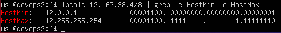
    
    Min - 12.0.0.1
    Max - 12.255.255.24
  
  - _/11111111.11111111.00000000.00000000_
    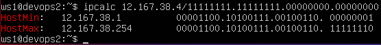
    
    Min - 12.167.38.1
    Max - 12.167.38.354
  
  - _/255.255.255.254_
    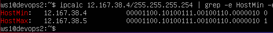

    Min - 12.167.38.4
    Max - 12.167.38.5

  - _/4_
    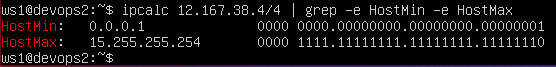

    Min - 0.0.0.1
    Max - 15.255.255.254

### 1.2 localhost

| IP            | Is Access |
| ------------- | --------- |
| 194.34.23.100 | False     |
| 127.0.0.2     | True      |
| 127.1.0.1     | True      |
| 128.0.0.1     | False     |

### 1.3 Network ranges and segments
  - Public/Private IP:
    | IP             | Range   |
    | -------------- | ------- |
    | 10.0.0.45      | Private |
    | 134.43.0.2     | Public  |
    | 192.168.4.2    | Private |
    | 172.20.250.4   | Private |
    | 172.0.2.1      | Public  |
    | 192.172.0.1    | Public  |
    | 172.68.0.2     | Public  |
    | 172.16.255.255 | Private |
    | 10.10.10.10    | Private |
    | 192.169.168.1  | Public  |
  
  - Possible gateway IP addresses for _10.10.0.0/18_ network:
    | IP          | Possible |
    |-------------|----------|
    | 10.0.0.1    | False    |
    | 10.10.0.2   | True     |
    | 10.10.10.10 | True     |
    | 10.10.100.1 | False    |
    | 10.10.1.255 | True     |

## Part 2. Static routing between two machines

  - Existing network interfaces on _ws1_ and _ws2_ with the `ip a` command:
    - _ws1_
    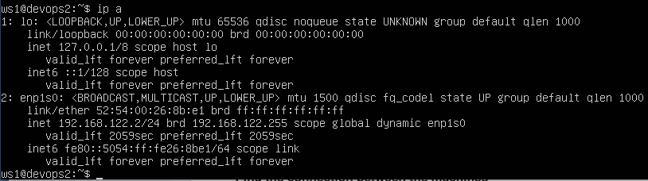

    - _ws2_
    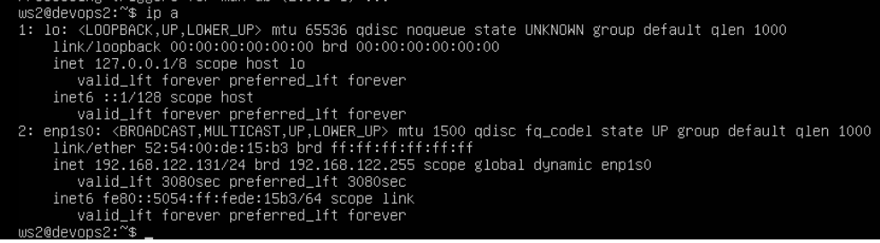

  - Describe the network interface for _ws1_ and _ws2_:
    - _ws1_
    
    - _ws2_
    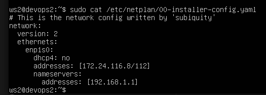

  - Restart the network service with `netplan apply` command:
    - _ws1_
    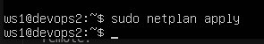
    - _ws2_
    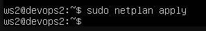

### 2.1 Adding a static route manually
  
  - Add static route:
    - from _ws1_ to _ws2_
      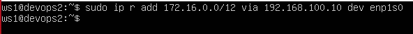
  
    - from _ws2_ to _ws1_
      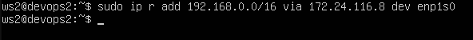
  
  - Ping:
    - From _ws1_ to _ws2_ 
      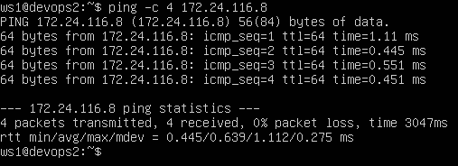
    - From _ws2_ to _ws1_
      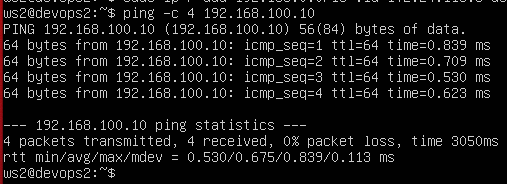

### 2.2 Adding a static route with saving

  - Add static route to another using _/etc/netplan/00-installer-config.yaml_:
    - From _ws1_ to _ws2_
      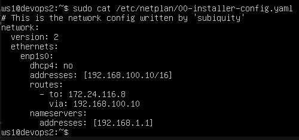
    
    - From _ws2_ to _ws1_
      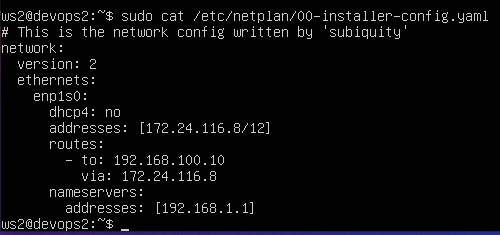

  - Ping:
    - _ws1_
      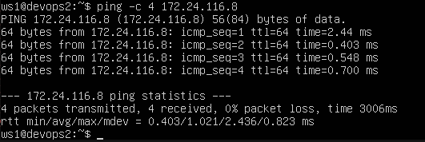
    - _ws2_
      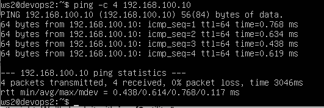
      

## Part 3. perf3 utility

### 3.1. Connection speed

| Base    | Convert      |
|---------|--------------|
| 8 Mbps  | 1 MB/s       |
| 10 MB/s | 819 200 Kbps |
| 1 Gbps  | 1024 Mbps    |

### 3.2. iperf3 utility

  - Measure connection speed between _ws1_ and _ws2_:
    - _ws1_ (Server)
      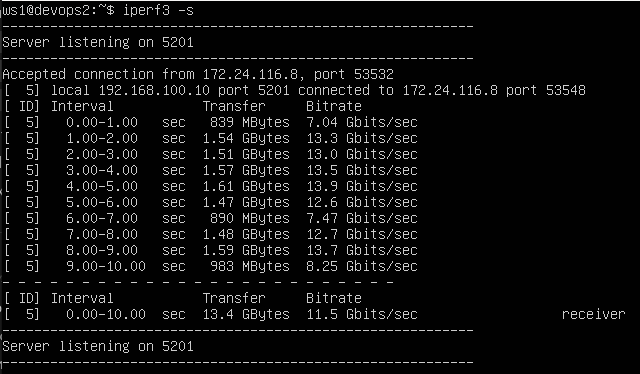
    - _ws2_ (Client)
      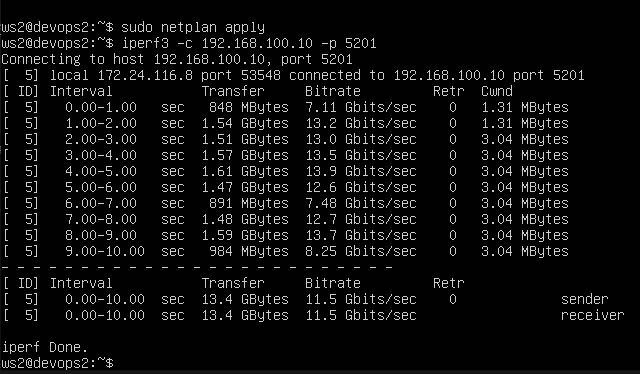

## Part 4. Network firewall

### 4.1. iptables utility

  - Create file _/etc/firewall.sh_ and add rules from the task
    - _ws1_
      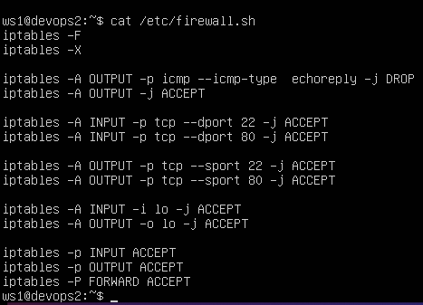
    - _ws2_
      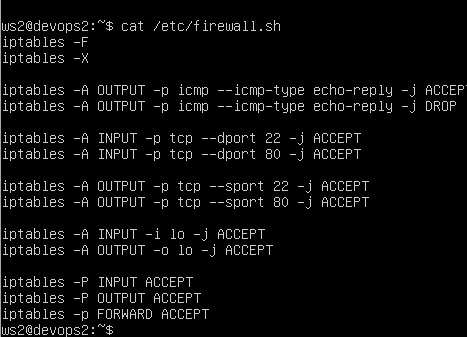
  
  - Run files 
    - _ws1_
      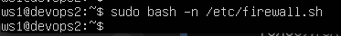
    - _ws2_
      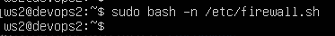

### 4.2. nmap utility

  - Use `ping` command to find a machine whoch no pinged:
    - _ws1_
      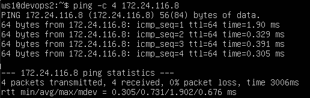
    - _ws2_
      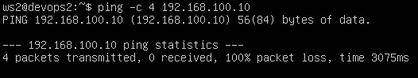

  - Use the `nmap` utility to show that the machine host is up
    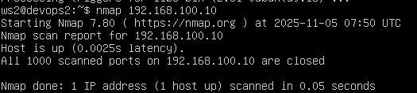 

## Part 5. Static network routing
### 5.1. Configuration of machine addresses

  - Set up the machine configurations in _etc/netplan/00-installer-config.yaml_:
    - _ws11_
      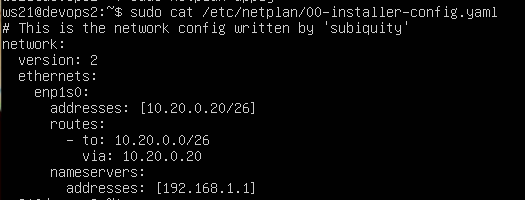
    - _ws21_
      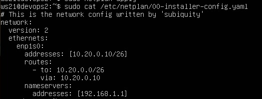
    - _ws22_
      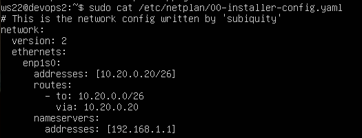
    - _r1_
      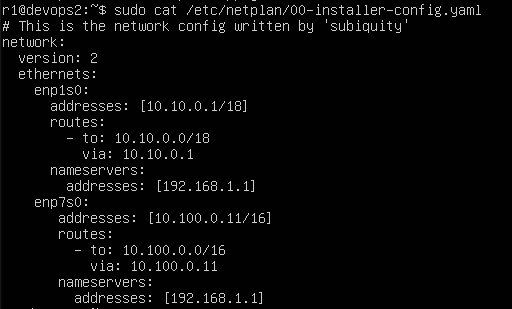
    - _r2_
      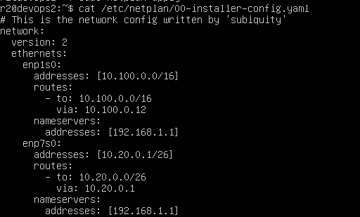
  
  - Result of  `ip -4 a` command:
    - _ws11_
      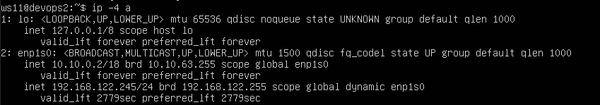
    - _ws21_
      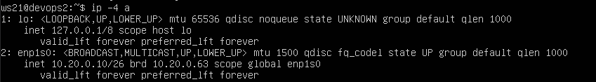
    - _ws22_
      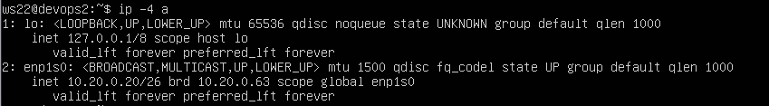
    - _r1_
      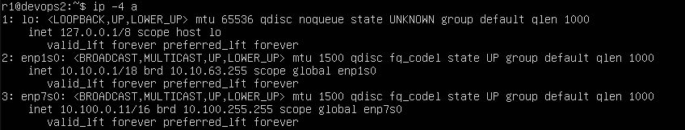
    - _r2_
      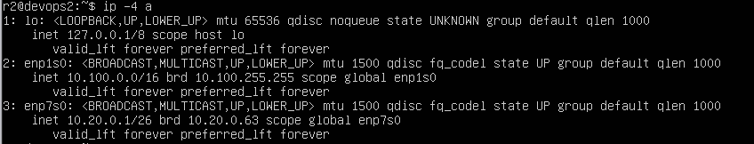
  
  - Ping:
    - _ws21_ -> _ws22_
      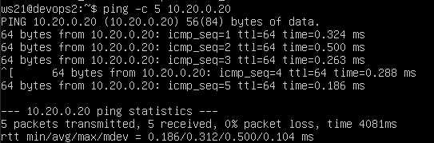
    - _ws11_ -> _r1_
      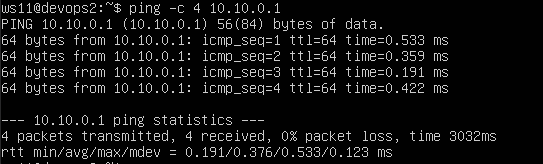

### 5.2. Enabling IP forwarding
  - Enable IP forwarding on the routers with `sysctl -w net.ipv4.ip_forward=1` command:
    - _r1_
      
    - _r2_
      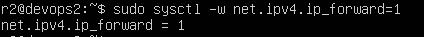
  - Open /etc/sysctl.conf file and add `net.ipv4.ip_forward=1`
    - _r1_
      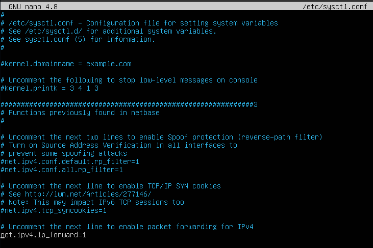
    - _r2_
      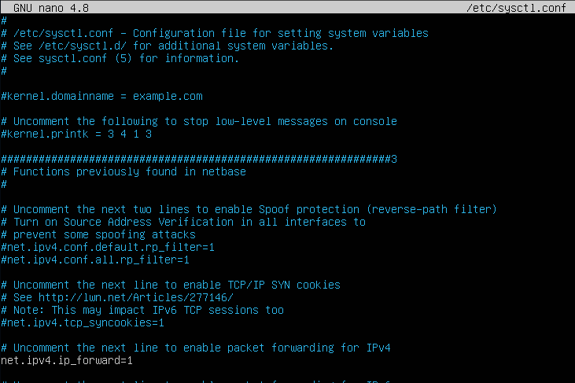

### 5.3. Default route configuration
  - Configure the defaul route for the workstations at `/etc/netplan/00-installer-config.yaml`:
    - _ws11_
      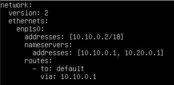
    - _ws21_
      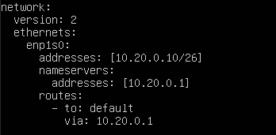
    - _ws22_
      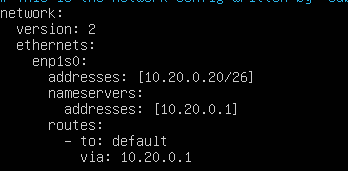
  
  - Call `ip r`
    - _ws11_
      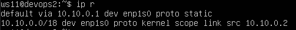
    - _ws21_
      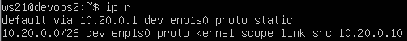
    - _ws22_
      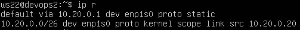
  
  - Ping _ws11_ -> _r2
  - _ws11_
    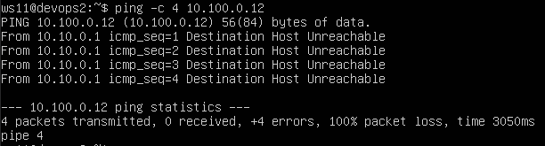
  - _r2_
    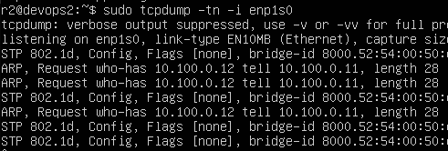

### 5.4. Adding static routes
 
  - Add static routes to _r1_ and _r2_ in configuration files:
    - _r1_
      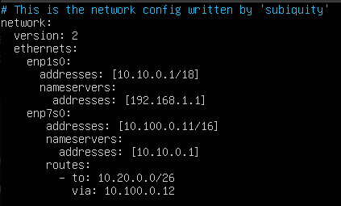
    - _r2_
      
  
  - Call `ip r` and show route tables:
    - _r1_
      
    - _r2_
      
    
  - Run `ip r list 10.10.0.0/[netmask]` and `ip r list 0.0.0.0/0` on _ws11_:
    - `ip r list 10.10.0.0/[netmsk]`
      
    - `ip r list 0.0.0.0/0`
      
    - The reason the `10.10.0.0/18`network has a route other than `0.0.0.0/0` is because it’s more specific. A `/18` route covers a much smaller range of addresses, while `/0` matches literally every IP.

### 5.5. Making a router list

  - Run the `tcpdump -tnv -i enp1s01` dump command on _r1_
    

  - Build a list of routers from _ws11_ to _ws21_ using the `traceroute` utility.
    
   - The traceroute tool works by showing all the routers a packet travels through on its way to the destination. It does this using the TTL (Time-to-Live) field and ICMP messages.
   TTL is basically a counter in every IP packet that tells how many “hops” the packet can make before it’s discarded. The first packet starts with a TTL of 1. When it reaches the first router, the router reduces the TTL by one — it hits zero — and the router sends back an ICMP “Time Exceeded” message to let you know it was there.
   Then traceroute sends another packet, this time with TTL set to 2. That one gets through the first router and expires at the second one, which also replies.
   Traceroute keeps repeating this, increasing TTL by one each time, so you can see the full path your packets take to reach the destination.

### 5.6. Using ICMP protocol in routing
  - Run on _r1_ network traffic capture with the `tcpdump -n -i enp1s0 icmp` command
  - Ping non-existent IP (10.30.0.111) from _ws11_
    
  - Result of ping at dump:
    

## Part 6. Dynamic IP configuration using DHCP
  - Configure the DHCP service in the /etc/dhcp/dhcpd.conf file for _r2_:
    
  - Write `nameserver 8.8.8.8` in _/etc/resolv.conf_ file
    
  - Restart the DHCP service with `systemctl restart isc-dhcp-server`
    
  - Reboot the _ws21_ machine with `reboot`
  - Result of `ip a`
   
  - Ping _ws21_ -> _ws22_
    
  - Add `macaddress` parameter at _ws11_
    
  - Configure _r1_ the same way as _r2_, but make the assignment of addresse stricly linked to the MAC-address (_ws11_):
    - Configure DHCP service
      
    - Write `nameserver 8.8.8.8` in _/etc/resolv.conf_ file
      
    - Restart the DHCP service
      
    - Reboot _ws11_
    - Result of `ip a`
      
  - Request IP address update from _ws21_
    - Before
      
    - After
      
  - Used DHCP options:
    - _subnet_ - defines the network for which the DHCP server assigns IP addresses.
    -  _netmask_ - specifies the subnetmask.
    -  _range [IP-min][IP-max] - sets the range of IP addresses available for clients to obtain DHCP server.
    -  _option routers_ - defines the default gateway used to access networks outside the local one.
    -  _option domain-name-servers_ - secifies the addresses of DNS servers.
    -  _host_ - assigns static IP addresses based on a machine`s MAC address.

## Part 7. NAT

- Make the __Apache2__ server public:
  - _r1_
    
  - _ws22_
    
- Start the Apache web server with `service apache2 start` command:
  - _r1_
    
  - _ws22_
    
- Add to the firewall on _r2_, created similary to the firewall from __Part 4__, folowing rules:
  
- Run the file as in __Part 4__:
  - 
  - 
- Check connection between _ws22_ and _r1_:
  
- Enable SNAT (Source Network Address Translation) and DNAT (Destination Network Address Translation), and allow connections via the TCP protocol on port 80:
  
  